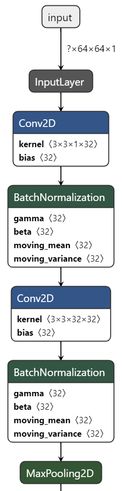

# Real-Time-Facial-Expression-Recognition
This repository contains my solution to the Real-Time Facial Expression Recognition problem. The dataset used for this problem is the [FER-2013](https://www.kaggle.com/c/challenges-in-representation-learning-facial-expression-recognition-challenge/data) dataset and for data annotation of the [FER-2013](https://www.kaggle.com/c/challenges-in-representation-learning-facial-expression-recognition-challenge/data) dataset, the [FERPlus](https://github.com/microsoft/FERPlus) dataset is used. The CNN architecture used in this repository is similar to the [VGG16](https://arxiv.org/pdf/1409.1556.pdf) but the model I used has less trainable params(1.2M) compared to the original VGG16(138.4M) model and the model I used also have BatchNormalization layers for regularization purposes.

### Required Package
This project requires **Python** and the following Python packages:
- [NumPy](https://www.numpy.org/)
- [Pandas](https://pandas.pydata.org/)
- [matplotlib](https://matplotlib.org/)
- [seaborn](https://seaborn.pydata.org/)
- [TensorFlow](https://www.tensorflow.org/)
- [OpenCV](https://opencv.org/)
- [scikit-learn](https://scikit-learn.org/stable/)
- [shutil](https://docs.python.org/3/library/shutil.html)
- [split-folders](https://pypi.org/project/split-folders)
- [glob](https://docs.python.org/3/library/glob.html)
- [os](https://docs.python.org/3/library/os.html)
- [csv](https://docs.python.org/3/library/csv.html)
- [Pillow](https://pypi.org/project/Pillow/2.2.1)

If you do not have Python installed yet, it is highly recommended that you install the [Anaconda](https://www.anaconda.com/) distribution of Python, which already has most of the above packages. 

### Short Description of Each Source Code File
1. **data_preprocessing.py**- This file turns the pixel data of [FER-2013](https://www.kaggle.com/c/challenges-in-representation-learning-facial-expression-recognition-challenge/data) into images and saves the images into a specific directory according to the annotations specified in the [FERPlus](https://github.com/microsoft/FERPlus) dataset.

2. **random_split.py**- I use [split-folders](https://pypi.org/project/split-folders) to randomly shuffle my data to make train set and validation set because according to [François Chollet](https://fchollet.com/), creator and project lead of [Keras- Deep learning library](https://keras.io/),

>"Correct. The validation data is picked as the last 10% (for instance, if validation_split=0.9) of the input. The training data (the remainder) can optionally be shuffled at every epoch (shuffle argument in fit). That doesn't affect the validation data, obviously, it has to be the same set from epoch to epoch." [GitHub Post Link](https://github.com/keras-team/keras/issues/597).  

3. **contrast.py**- return images with increased contrast to the training set. (Used for data augmentation)

4. **sharpness.py**- return images with increased sharpness in the training set. (Used for data augmentation)

5. **random_shuffle.py**- The original training images and images generated by *contrast.py* and *sharpness.py* are added together. Then all the training images are randomly shuffled and the shuffled images are saved into the specific directory with a fixed naming convention.

6. **main.py**- This script contains a convolutional neural network(CNN) architecture that is similar to the [VGG16](https://arxiv.org/pdf/1409.1556.pdf) but the model I used has less trainable params(1.2M) compared to the original VGG16(138.4M) model and the model I used also have BatchNormalization layers for regularization purposes. This model is run for 50 epochs and the best model was used for final submission. Graphical visualization of initial part of the model: [(Link of graphical visualization of the full model)](https://github.com/Safayet-Khan/Real-Time-Facial-Expression-Recognition/blob/main/images/model.png)  

  

7. **best_model.py**- I use this script to load all the trained models *(.h5 file)* and generate a confusion matrix, F1-score, and accuracy of each model. Based on the results, the final model is selected. Note that, I have used a validation set as a test set which is not recommended (This was done due to shortage of data). This process of manually choosing the best model *(.h5 file)* is done because [focal loss](https://arxiv.org/pdf/1708.02002.pdf) is used as a loss function in the program.

8. **video_test.py**- This script loads the default [haarcascade_frontalface](https://github.com/opencv/opencv/tree/master/data/haarcascades) *(.xml file)* of [OpenCV](https://opencv.org/) and also loads the best-trained model. By using the trained model for real-time facial expression is detected via webcam. 

