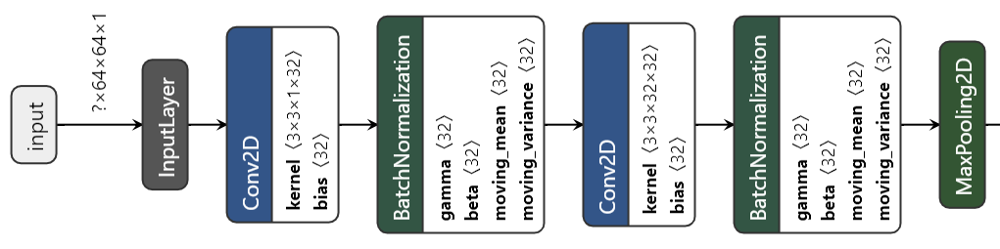

# Real-Time-Facial-Expression-Recognition
This repository contains my solution to the Real-Time Facial Expression Recognition problem. The dataset used for this problem is the [FER-2013](https://www.kaggle.com/c/challenges-in-representation-learning-facial-expression-recognition-challenge/data) dataset and for data annotation of the [FER-2013](https://www.kaggle.com/c/challenges-in-representation-learning-facial-expression-recognition-challenge/data) dataset, the [FERPlus](https://github.com/microsoft/FERPlus) dataset is used. The CNN architecture used in this repository is similar to the [VGG16](https://arxiv.org/pdf/1409.1556.pdf) but the model I used has less trainable params(1.2M) compared to the original VGG16(138.4M) model and the model I used also have BatchNormalization layers for regularization purposes.

### Required Package
This project requires **Python** and the following Python packages:
- [NumPy](https://www.numpy.org/)
- [Pandas](https://pandas.pydata.org/)
- [matplotlib](https://matplotlib.org/)
- [seaborn](https://seaborn.pydata.org/)
- [TensorFlow](https://www.tensorflow.org/)
- [OpenCV](https://opencv.org/)
- [scikit-learn](https://scikit-learn.org/stable/)
- [shutil](https://docs.python.org/3/library/shutil.html)
- [split-folders](https://pypi.org/project/split-folders)
- [glob](https://docs.python.org/3/library/glob.html)
- [os](https://docs.python.org/3/library/os.html)
- [csv](https://docs.python.org/3/library/csv.html)
- [Pillow](https://pypi.org/project/Pillow/2.2.1)

If you do not have Python installed yet, it is highly recommended that you install the [Anaconda](https://www.anaconda.com/) distribution of Python, which already has most of the above packages. 

### Analysis of Training Data
The Facial Emotion Recognition (FER) dataset has a huge class imbalance problem. This bias/imbalance in the raw training dataset influences machine learning algorithms to ignore the minority class entirely. This is a major problem of facial emotion recognition. To solve this problem partially, the [oversampling](https://en.wikipedia.org/wiki/Oversampling_and_undersampling_in_data_analysis) technique is used. The dataset is increased between 3 to 16 folds per class. After the oversampling in the training dataset, all the images are randomly shuffled and the shuffled images are saved into the specific directory with a fixed naming convention. In the time of training. Random data augmentation is applied in a controlled way. Thus, this oversampling of training data not only contributes to solving the class imbalance problem, but also contributes to solving the overfitting of the model. Visualization of numbers of images per class in the data set before and after preprocessing.

  

### Loss Function- ***[Focal Loss](https://arxiv.org/pdf/1708.02002.pdf)***
From the analysis of training data, we can see that in this dataset there remains a huge class imbalance problem. To solve this, I have used [oversampling](https://en.wikipedia.org/wiki/Oversampling_and_undersampling_in_data_analysis) with [focal loss](https://arxiv.org/pdf/1708.02002.pdf) function. Usually, focal loss gives less weight to those classes which have lots of examples and gives more weight to those classes which have fewer examples. Focal loss was first implemented in [Focal Loss for Dense Object Detection](https://arxiv.org/pdf/1708.02002.pdf) paper. The focal loss paper reports:

>The large class imbalance encountered during training of dense detectors overwhelms the cross entropy loss. Easily classified negatives comprise the majority of the loss and dominate the gradient. While α balances the importance of positive/negative examples, it does not differentiate between easy/hard examples.

It may be irrelevant to write this here, but I like an analogy about [focal loss](https://arxiv.org/pdf/1708.02002.pdf) written in a [medium article](https://medium.com/visionwizard/understanding-focal-loss-a-quick-read-b914422913e7) so I am sharing it anyway. 

>Let’s consider a scenario of a soccer match. You are seeing your favorite rivalry of Real Madrid vs Barcelona on television. The stadium is fully packed with the audience chanting for their respective teams with a total of **70,000** people. Suddenly Real Madrid scores and whole stadium bursts will the chants of “Goaalll..!!”. No one can hear anything but chants, chants, and chants. 3 commentators are analyzing the match that these telecast reporters want to show on the TV. So what they do to? They give **more importance** to the commentary and give **less weight** to the chants so that people watching on television can listen to the commentary and live match analysis. Yes, you will hear the chants while watching but, commentary voice will get more amplified.

Last addition to focal loss. Reading the original paper [Focal Loss for Dense Object Detection](https://arxiv.org/pdf/1708.02002.pdf) and understanding it completely was hard for me. This blog [Use Focal Loss To Train Model Using Imbalanced Dataset](https://leimao.github.io/blog/Focal-Loss-Explained/) helped me a lot while I was reading the original paper. 

### Short Description of Each Source Code File
1. **data_preprocessing.py**- This file turns the pixel data of [FER-2013](https://www.kaggle.com/c/challenges-in-representation-learning-facial-expression-recognition-challenge/data) into images and saves the images into a specific directory according to the annotations specified in the [FERPlus](https://github.com/microsoft/FERPlus) dataset.

2. **random_split.py**- I use [split-folders](https://pypi.org/project/split-folders) to randomly shuffle my data to make train set and validation set because according to [François Chollet](https://fchollet.com/), creator and project lead of [Keras- Deep learning library](https://keras.io/),

>"Correct. The validation data is picked as the last 10% (for instance, if validation_split=0.9) of the input. The training data (the remainder) can optionally be shuffled at every epoch (shuffle argument in fit). That doesn't affect the validation data, obviously, it has to be the same set from epoch to epoch." [GitHub Post Link](https://github.com/keras-team/keras/issues/597).  

3. **contrast.py**- return images with increased contrast to the training set. (Used for data augmentation)

4. **sharpness.py**- return images with increased sharpness in the training set. (Used for data augmentation)

5. **random_shuffle.py**- The original training images and images generated by *contrast.py* and *sharpness.py* are added together. Then all the training images are randomly shuffled and the shuffled images are saved into the specific directory with a fixed naming convention.

6. **analysis_of_training_data.py**- return bar graph, showing the number of images per class of raw data and the number of training images per class after [oversampling](https://en.wikipedia.org/wiki/Oversampling_and_undersampling_in_data_analysis) images.

7. **main.py**- This script contains a convolutional neural network(CNN) architecture that is similar to the [VGG16](https://arxiv.org/pdf/1409.1556.pdf) but the model I used has less trainable params(1.2M) compared to the original VGG16(138.4M) model and the model I used also have BatchNormalization layers for regularization purposes. This model is run for 50 epochs and the best model was used for final submission. Graphical visualization of initial part of the model: [(Link of graphical visualization of the full model)](https://github.com/Safayet-Khan/Real-Time-Facial-Expression-Recognition/blob/main/images/model.png)  

  

8. **best_model.py**- I use this script to load all the trained models *(.h5 file)* and generate a confusion matrix, F1-score, and accuracy of each model. Based on the results, the final model is selected. Note that, I have used a validation set as a test set which is not recommended (This was done due to shortage of data). This process of manually choosing the best model *(.h5 file)* is done because [focal loss](https://arxiv.org/pdf/1708.02002.pdf) is used as a loss function in the program. Visualization of confusion matrix of the best model (from my perspective) with accuracy and F1-score. 

  

9. **video_test.py**- This script loads the [haarcascade_frontalface_default.xml](https://github.com/opencv/opencv/tree/master/data/haarcascades) of [OpenCV](https://opencv.org/) to detect the human frontal face and also loads the best-trained model. By using the trained model for real-time facial expression is detected via webcam. 

### Reference
- [Challenges in Representation Learning: Facial Expression Recognition Challenge](https://www.kaggle.com/c/challenges-in-representation-learning-facial-expression-recognition-challenge/data)
- [Facial Expression Recognition Plus (FER+)](https://github.com/microsoft/FERPlus)
- [VERY DEEP CONVOLUTIONAL NETWORKS FOR LARGE-SCALE IMAGE RECOGNITION](https://arxiv.org/pdf/1409.1556.pdf)
- [opencv-haarcascades](https://github.com/opencv/opencv/tree/master/data/haarcascades)
- [Focal Loss for Dense Object Detection](https://arxiv.org/pdf/1708.02002.pdf)
- [Use Focal Loss To Train Model Using Imbalanced Dataset](https://leimao.github.io/blog/Focal-Loss-Explained/)
- [Understanding Focal Loss —A Quick Read](https://medium.com/visionwizard/understanding-focal-loss-a-quick-read-b914422913e7)
- [Netron: Visualizer for neural network, deep learning and machine learning models](https://github.com/lutzroeder/netron)
